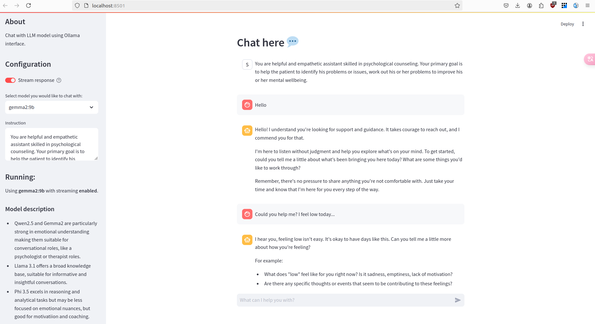

# Chat with any LLM using Ollama and WebUI interface.
WebUI for chatting with LLMs.



## Install
```sh
# clone repository
$ git clone https://github.com/kirillsaidov/llm_chat.git
$ cd llm_chat/

# install python dependencies
$ python3 -m venv venv && source ./venv/bin/activate
$ pip install -r requirements.txt
```

## Run
Run directly:
```sh
# run now
$ streamlit run chatui/chatui.py --server.port=8501

# launch in background
$ nohup streamlit run chatui/chatui.py --server.port=8501 > streamlit.log 2>&1 &
```

Run using Docker:
```sh
# build container
docker buildx build -f Dockerfile -t llm_chat:latest .

# run app
docker run -d --network=host --name=llm_chat \
    llm_chat:latest --server.port=8501
```

Output:
```
You can now view your Streamlit app in your browser.

Local URL: http://localhost:8501
Network URL: http://xxx.xxx.xxx.xxx:8501
```

## LICENSE
Unlicense. You can do whatever you want with the repo files.


